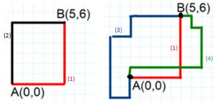
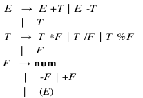
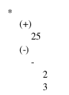
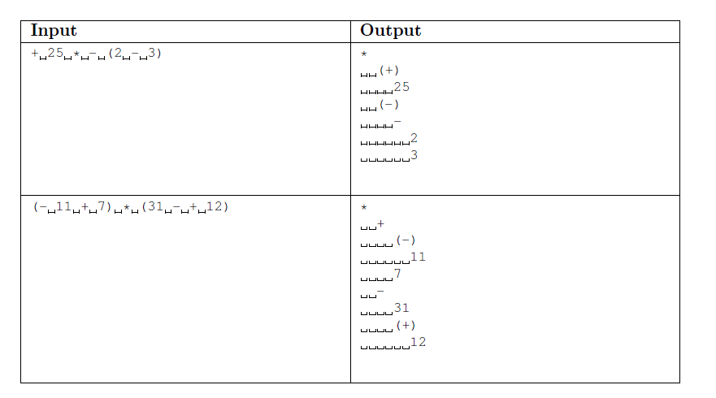

# compilers project

final project for the compilers course

## Project Requirements

### 1. The Taxy way

Create the syntax analyzer of a small language to recognize movement statements into a Cartesian plane. Your program should read from standard input.

The input consists of a single line containing a path that is a sequence of four possible instructions:

- UP n
- DOWN n
- RIGHT n
- LEFT n

UP, DOWN, RIGHT, LEFT are the directions along the axis, n a positive integer that represents how many unitary steps must be done in the specified direction.
As output, the parser checks whether the inserted path is or not a valid path for moving from one
assigned point, e.g. A(0,0), to one other assigned point, e.g. B(5,6).
To reach B from A there are infinite valid paths, example of valid paths are:

<span style="color:red">(1) RIGHT 5 UP 6</span><br/>
<span style="color:black">(2) UP 6 RIGHT 5</span><br/>
<span style="color:blue">(3) DOWN 2 LEFT 2 UP 6 RIGHT 2 UP 2 RIGHT 5</span><br/>
<span style="color:green">(4) UP 1 RIGHT 7 UP 4 LEFT 1 UP 1 LEFT 1</span>

The 4 possible input above corresponds to the 4 valid paths in figure:
<br/>
When the inserted path is wrong you can either print an error message, or even print a possible couple
of moves to reach the destination B

### 2. Translate the infix calculator notation into an abstract syntax tree (AST)

Create the syntax analyzer of a calculator with infix notation.
The calculator grammar is as follows:

<br/>
The compiler will need to translate the input into infix calculator notation to an AST.

To construct an AST, you have to handle multiple types, say integers and pointers to tree nodes.
For the following expression, for example:

\+ 25 * - (2 - 3)

your program should produce the following output:



Note that the unary operators are printed enclosed by a pair of parentheses.
Your program should read from standard input. The input consists of a single line containing an
arithmetic expression. The program should print to standard output the tree with space indentations
(all the nodes at the same level have the same number of space indentations), as in the following table:


## How to Run

### First Exercise

To run the [first Exercise](#1-the-taxy-way):

1. go to the taxyway's folder

    `cd taxyway`

2. remove all executables from the folder

    `make clean`

3. compile the program

    `make`
4. run the program

    `./taxyway`

*Example:*

```
./taxyway

UP 6 RIGHT 5
Arrival point: X: 5, Y: 6
Goal : X: 5, Y: 6
GREAT! You reached the goal!
```

### Second Exercise

To run the [second Exercise](#2-translate-the-infix-calculator-notation-into-an-abstract-syntax-tree-ast):

1. go to the abstract syntax tree's folder

    `cd abstract\ syntax\ tree`

2. remove all executables from the folder

    `make clean`

3. compile the program

    `make`
4. run the program

    `./ast`

*Example:*

```
./ast

+25*-(2-3)
*
  (+)
    25
  (-)
    -
      2
      3
```
